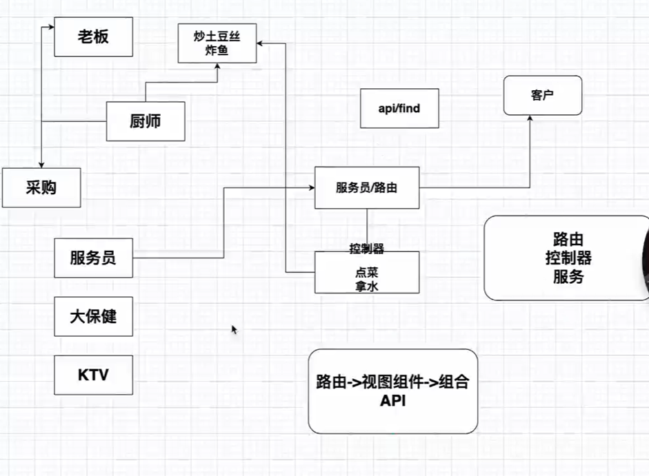

# nest学习笔记
## 全局安装pnpm(硬连接)
* npm install -g pnpm

## 全局安装nest
* pnpm install -g @nestjs/cli nodemon ts-node

## 创建nest项目
* nest new project-name

## vscode安装Prisma插件

## 模块/控制器/路由/服务器概念
* 模块：一个模块就是一个文件夹，里面包含一个或多个控制器
* 控制器：一个控制器就是一个文件夹，里面包含一个或多个路由
* 路由：一个路由就是一个文件夹，里面包含一个或多个路由
* 服务器：一个服务器就是一个文件夹，里面包含一个或多个模块



## 什么是依赖注入
* 依赖注入是一种设计模式，用于在运行时将依赖项注入到对象中
* 依赖注入是一种控制反转（IoC）的方式，将依赖项的控制权从使用它们的对象转移到容器中
* 依赖注入是一种解耦的方式，使得对象之间的依赖关系更加清晰和易于管理
```
import { Controller, Get } from '@nestjs/common';
import { PrismaService } from './prisma.service';

@Controller('users')
export class UsersController {
  constructor(private prisma: PrismaService) {}

  @Get()
  async getUsers() {
    return this.prisma.user.findMany();
  }
}
```

## 什么是依赖注入容器
* 依赖注入容器是一个用于管理依赖项和注入它们的容器的工具
* 依赖注入容器是一个用于管理依赖项和注入它们的容器的工具

## 创建服务
* nest generate service users --no-spec -h
* -h: 查看细节
* -d: 不是真正创建，尝试看结果
* --no-spec: 不创建测试文件